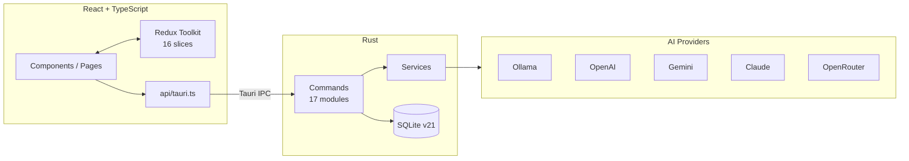

<p align="center">
  
</p>

<h1 align="center">Genesis Chronicle</h1>

<p align="center">
  <a href="LICENSE"></a>
  
  
  
</p>

<p align="center">
  <a href="https://genesis-chronicle.zeabur.app/">Website</a> · <strong>English</strong> · <a href="README_zh_TW.md">繁體中文</a> · <a href="CHANGELOG.md">Changelog</a> · <a href="docs/">Docs</a>
</p>

A desktop app for writing Chinese light novels. It handles the parts around the writing — continuing a draft with AI, keeping characters consistent, generating illustrations, and exporting a finished EPUB or PDF — so the writing itself stays in one place.

> **"Your story deserves to be told well."**

## What it does

Most AI writing tools stop at generating text. That leaves you assembling a novel across a text editor, an image tool, and whatever converts your manuscript into something readable on an e-reader. Genesis Chronicle keeps all four in one desktop app.

The AI side is provider-agnostic. Ollama runs locally if you'd rather nothing leaves your machine; OpenAI, Gemini, Claude, and OpenRouter are there when you want the bigger models. Switching providers doesn't change how the app behaves — they all sit behind one trait in the Rust backend.

It's built on Tauri rather than Electron, which is why a 465-file app ships at 55MB and idles under 150MB of RAM. That decision is covered further down.

## Features

| Feature | What it does |
|---------|--------------|
| **AI continuation** | Continues your draft with awareness of chapter style and prior context. Handles documents past 100k characters by compressing context rather than truncating it |
| **Character analysis** | Big Five personality profiling from your own text, with radar charts, emotional trend lines, and consistency checks across chapters |
| **Illustration generation** | Batch-generates images, shows them in a gallery for selection, and tracks versions. Four style modes: realistic, anime, concept art, manga |
| **EPUB 3.0 export** | Slate.js content converted to XHTML with embedded Chinese fonts and generated covers |
| **PDF export** | Rendered through Chrome Headless, which sidesteps the Chinese font problems that broke three earlier implementations |
| **Focus mode** | Full-screen writing with everything else faded out. No AI panels, no sidebars |
| **Genre templates** | Fantasy, campus romance, isekai, and sci-fi starters — each with world-building notes, character frames, and a plot outline. Or start blank |

## Architecture



Every frontend call goes through `api/tauri.ts` — never `invoke()` directly. That layer wraps responses in `APIResponse<T>`, so bypassing it means bypassing error handling.

Full detail in [docs/ARCHITECTURE.md](docs/ARCHITECTURE.md).

## Tech Stack

| Technology | Purpose | Notes |
|------------|---------|-------|
| Tauri v2.7 | App shell | Version pinned exactly — see the note in [docs/TOOLING.md](docs/TOOLING.md) |
| Rust | Backend | 24,794 lines across 78 files |
| React 18 + TypeScript | Frontend | 82,416 lines across 349 files |
| Redux Toolkit | State | 16 slices; all shared state goes through it |
| Slate.js | Editor | 2-second autosave, remounted per chapter |
| SQLite | Storage | Schema v21, separate dev and production databases |
| Tailwind CSS v4 | Styling | Design tokens rebuilt for v4 in 2.0.0 |
| Chrome Headless | PDF rendering | Falls back to lopdf when Chrome isn't found |

## Quick Start

### Install

**macOS**

```bash
curl -L -o genesis-chronicle.dmg \
  https://github.com/tznthou/Otherworldly-Creation/releases/latest/download/genesis-chronicle.dmg
```

Open the DMG and drag the app to Applications.

**Windows** — download and run [the MSI installer](https://github.com/tznthou/Otherworldly-Creation/releases/latest).

### First five minutes

1. **New project** — Creator Mode → New Project. Pick a genre template or start blank
2. **Add an API key** — Settings → General has a card pointing at the AI configuration. Ollama needs no key; the rest do
3. **Write** — Chapter Editor. AI continuation, character analysis, and illustration live in the side panels
4. **Export** — Legacy Compilation → EPUB or PDF

## Development

### Prerequisites

- Node.js 18+
- Rust 1.77.2+
- API keys for whichever providers you plan to use

### Setup

```bash
git clone https://github.com/tznthou/Otherworldly-Creation.git
cd Otherworldly-Creation
npm install

npm run dev              # full Tauri app
npm run dev:renderer     # frontend only, for UI work
```

This is a desktop app. `npm run dev:renderer` serves the UI in a browser, but anything touching the backend will fail there — Tauri IPC doesn't exist outside the app shell.

### Checks

```bash
npx tsc --noEmit                                    # types
npm run lint                                        # ESLint
cargo check --manifest-path src-tauri/Cargo.toml    # Rust
npm test                                            # Jest
```

### Build

```bash
npm run build                                       # production
cargo tauri build --target universal-apple-darwin   # macOS
cargo tauri build --target x86_64-pc-windows-msvc   # Windows
```

Release tooling — version syncing, code stats, pre-release checks — is documented in [docs/TOOLING.md](docs/TOOLING.md).

## Project Structure

```
Otherworldly-Creation/
├── src/renderer/src/       # React frontend
│   ├── api/                # Tauri IPC wrapper — the only way in
│   ├── components/         # 270 files across 18 feature areas
│   ├── pages/              # 8 top-level pages
│   ├── hooks/              # 53 files
│   ├── services/           # frontend business logic
│   └── store/              # Redux Toolkit, 16 slices
├── src-tauri/src/          # Rust backend
│   ├── commands/           # 17 Tauri command modules
│   ├── services/           # AI providers, illustration, context, translation
│   ├── database/           # models, migrations, connection
│   └── utils/              # PathManager and friends
├── docs/                   # architecture, tooling, testing
├── scripts/                # release automation
├── CHANGELOG.md            # English changelog
├── CHANGELOG_zh_TW.md      # Chinese changelog
├── README.md               # this file
└── README_zh_TW.md         # Chinese README
```

## Reflections

### Why this exists

The original scope fit in one sentence: write a novel, add a title page, end up with a real e-book. That was the whole idea.

I started before I knew enough to be intimidated by any of it. What followed looked nothing like the plan — Electron traded for Tauri inside five days, PDF rebuilt four times over, a month lost to a single Windows image path.

The detours turned out to be the interesting part.

### Design decisions

**Electron out, Tauri in — five days.** The project started on 2025-07-26 as an Electron app and got as far as v0.4.12. Three days after that tag, the Tauri migration began; two days later, v1.0.0 shipped with Electron entirely removed. The forcing function was memory: an editor that idles at 400MB is hard to justify for an app whose job is showing text. Tauri put it at 80–150MB. The cost was rewriting every IPC handler and losing the Electron ecosystem's convenience.

**PDF took four attempts.** printpdf, then lopdf, then a second pass at lopdf — each one worked until Chinese characters appeared. Embedding a CJK font meant shipping 7.1MB and still fighting the layout engine. The fourth attempt gave up on generating PDFs directly and rendered HTML through Chrome Headless instead. The browser already solved Chinese typography; there was no reason to solve it again. Roughly 2,000 lines of the earlier attempts were deleted.

**One trait for every AI provider.** Ollama, OpenAI, Gemini, Claude, and OpenRouter all implement the same Rust trait. Adding a provider means implementing that trait and registering it — no caller changes. It also means the local-only option isn't a second-class path; Ollama goes through the same code as everything else.

**API keys in the OS keyring.** They used to sit in `localStorage`. v1.2.8 moved them to Keychain / Credential Manager / Secret Service, with dual-write to localStorage as a fallback — a keyring failure degrades instead of locking you out of your own keys.

### What I learned

**Log the actual value.** Windows images were broken for nearly a month. SafeImage got rewritten, path handling got rewritten, `convertFileSrc` got audited — all of it guesswork. The fix took an hour once a detailed Windows log printed the real path: `uuid.jpg.jpg`. The database stored the filename with its extension, and the path builder appended `.jpg` unconditionally. Nothing about that was findable by reasoning; it needed one line of output.

**Version mismatches fail far from their cause.** v1.2.8 failed CI nine times in a row. The error messages pointed at the keyring dependency, the build command, the Tauri CLI install step — none of which were wrong. The Rust `tauri` crate was pinned while the NPM `@tauri-apps/*` packages had carets. Every Tauri package is now pinned exactly, with a comment in `Cargo.toml` explaining why.

**Automated cleanup breaks things quietly.** Removing ~1,000 `console.*` calls with scripts took 54 batches, and several of those batches were fixing what the previous batch broke — mangled `import` statements, duplicated `from` keywords. Mechanical refactors need the same review as hand-written changes.

## Roadmap

Optional, opt-in telemetry backed by NocoDB — anonymous usage patterns and crash reports, with the privacy controls already present in the UI. Not implemented yet; the UI toggles currently control nothing.

## Contributing

Fork, branch, and open a PR. Before submitting:

```bash
npm run lint && npx tsc --noEmit && npm test
cargo check --manifest-path src-tauri/Cargo.toml
```

Rust code goes through `cargo fmt`. Commit messages follow conventional commits. Bugs and questions belong in [Issues](https://github.com/tznthou/Otherworldly-Creation/issues).

## License

[MIT](LICENSE). A Chinese translation of the license terms is available in [LICENSE_zh_TW.md](LICENSE_zh_TW.md) for reference; the English LICENSE file governs.

## Acknowledgments

Built on Tauri, React, Slate.js, and the Rust and TypeScript ecosystems around them. The AI side depends on Ollama, OpenAI, Google, Anthropic, and OpenRouter.
