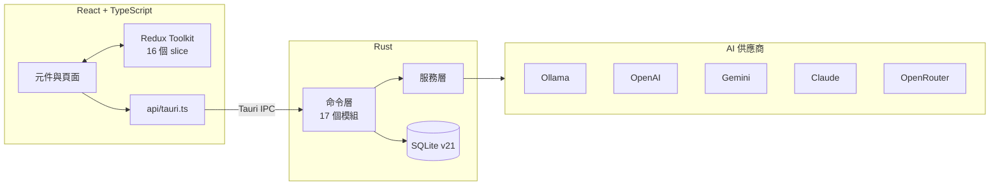

<p align="center">
  
</p>

<h1 align="center">創世紀元 Genesis Chronicle</h1>

<p align="center">
  <a href="LICENSE"></a>
  
  
  
</p>

<p align="center">
  <a href="https://genesis-chronicle.zeabur.app/">官方網站</a> · <a href="README.md">English</a> · <strong>繁體中文</strong> · <a href="CHANGELOG_zh_TW.md">更新日誌</a> · <a href="docs/">開發文檔</a>
</p>

寫中文輕小說的桌面應用程式。AI 續寫、角色一致性、插畫生成、EPUB / PDF 導出都在同一個地方，寫作的時候不用一直換工具。

> **「你的故事，值得被好好述說」**

## 這是什麼

多數 AI 寫作工具做完生成文字就結束了。剩下的事——把稿子排成能在電子書閱讀器上看的格式、生插圖、追蹤角色設定有沒有跑掉——得自己在三四個工具之間搬。創世紀元把這幾件事收在同一個桌面應用裡。

AI 的部分不綁供應商。不想讓稿子離開自己電腦就用本地的 Ollama，想要更強的模型就接 OpenAI、Gemini、Claude 或 OpenRouter。切換供應商不會改變操作方式，它們在 Rust 後端共用同一個 trait。

底層用 Tauri 而不是 Electron，所以 465 個檔案的應用打包起來只有 55MB，閒置時記憶體不到 150MB。這個選擇的來龍去脈寫在下面的隨想。

## 功能

| 功能 | 說明 |
|------|------|
| **AI 續寫** | 讀得懂章節風格與前文脈絡再續寫。超過 10 萬字的文件走壓縮而不是直接截斷 |
| **角色分析** | 從你寫的文字做 Big Five 人格分析，附雷達圖、情緒趨勢線，以及跨章節的一致性檢查 |
| **插畫生成** | 批次生成後進圖庫讓你挑，不是生一張就直接套。支援寫實、動漫、概念藝術、漫畫四種風格，含版本追蹤 |
| **EPUB 3.0 導出** | Slate.js 內容轉 XHTML，嵌入中文字型，可生成封面 |
| **PDF 導出** | 走 Chrome Headless 渲染，繞開了搞掉前三套實作的中文字型問題 |
| **專注寫作模式** | 全螢幕，其他東西全部淡出。沒有 AI 面板、沒有側邊欄 |
| **類型模板** | 奇幻冒險、校園戀愛、異世界轉生、科幻冒險，各附世界觀、角色框架與劇情大綱。也可以開空白專案 |

## 架構



前端所有呼叫都經過 `api/tauri.ts`，不直接用 `invoke()`。那一層統一包上 `APIResponse<T>`，繞過它等於繞過錯誤處理。

完整說明在 [docs/ARCHITECTURE.md](docs/ARCHITECTURE.md)。

## 技術棧

| 技術 | 用途 | 備註 |
|------|------|------|
| Tauri v2.7 | 應用外殼 | 版本精確鎖定，原因見 [docs/TOOLING.md](docs/TOOLING.md) |
| Rust | 後端 | 78 個檔案，24,794 行 |
| React 18 + TypeScript | 前端 | 349 個檔案，82,416 行 |
| Redux Toolkit | 狀態管理 | 16 個 slice，共用狀態一律走這裡 |
| Slate.js | 編輯器 | 2 秒自動存檔，切章節時強制 remount |
| SQLite | 資料儲存 | Schema v21，開發與正式環境分開 |
| Tailwind CSS v4 | 樣式 | 2.0.0 時把設計 token 改建在 v4 上 |
| Chrome Headless | PDF 渲染 | 找不到 Chrome 時降級回 lopdf |

## 快速開始

### 安裝

**macOS**

```bash
curl -L -o genesis-chronicle.dmg \
  https://github.com/tznthou/Otherworldly-Creation/releases/latest/download/genesis-chronicle.dmg
```

開啟 DMG，把應用程式拖進「應用程式」資料夾。

**Windows** — 下載並執行 [MSI 安裝程式](https://github.com/tznthou/Otherworldly-Creation/releases/latest)。

### 前五分鐘

1. **建立專案** — 創世神模式 → 新建專案。選一個類型模板，或直接開空白
2. **設定 API 金鑰** — 設定 → 一般，那裡有張卡片直接帶你到 AI 設定。用 Ollama 不需要金鑰，其他供應商需要
3. **開始寫** — 章節編輯器。AI 續寫、角色分析、插畫都在側邊面板
4. **導出** — 傳說編纂 → EPUB 或 PDF

## 開發

### 環境需求

- Node.js 18 以上
- Rust 1.77.2 以上
- 要用的 AI 供應商的 API 金鑰

### 起始設定

```bash
git clone https://github.com/tznthou/Otherworldly-Creation.git
cd Otherworldly-Creation
npm install

npm run dev              # 完整 Tauri 應用
npm run dev:renderer     # 只跑前端，做 UI 時用
```

這是桌面應用。`npm run dev:renderer` 會在瀏覽器開 UI，但任何碰到後端的操作都會失敗——Tauri IPC 在應用外殼之外不存在。

### 檢查

```bash
npx tsc --noEmit                                    # 型別
npm run lint                                        # ESLint
cargo check --manifest-path src-tauri/Cargo.toml    # Rust
npm test                                            # Jest
```

### 建置

```bash
npm run build                                       # 正式版
cargo tauri build --target universal-apple-darwin   # macOS
cargo tauri build --target x86_64-pc-windows-msvc   # Windows
```

版本同步、程式碼統計、發布前檢查這些工具寫在 [docs/TOOLING.md](docs/TOOLING.md)。

## 專案結構

```
Otherworldly-Creation/
├── src/renderer/src/       # React 前端
│   ├── api/                # Tauri IPC 封裝層，唯一入口
│   ├── components/         # 270 個檔案，分 18 個功能區
│   ├── pages/              # 8 個頂層頁面
│   ├── hooks/              # 53 個檔案
│   ├── services/           # 前端業務邏輯
│   └── store/              # Redux Toolkit，16 個 slice
├── src-tauri/src/          # Rust 後端
│   ├── commands/           # 17 個 Tauri 命令模組
│   ├── services/           # AI 供應商、插畫、上下文、翻譯
│   ├── database/           # 資料模型、遷移、連線
│   └── utils/              # PathManager 等工具
├── docs/                   # 架構、工具鏈、測試
├── scripts/                # 發布自動化
├── CHANGELOG.md            # 英文更新日誌
├── CHANGELOG_zh_TW.md      # 中文更新日誌
├── README.md               # 英文 README
└── README_zh_TW.md         # 本檔
```

## 隨想

### 為什麼做這個

一開始想要的東西很單純：能自己寫小說，能加上扉頁，最後能變成一本真正的電子書。就這樣，沒有更多了。

當時大概是初生之犢不畏虎，什麼都還沒想清楚就一頭栽下去。結果沒想到會經歷那麼多事——Electron 五天內換成 Tauri、PDF 重做四次、Windows 的圖片路徑修了一個月。這些在動手前完全不在預期裡。

回頭看，這些過程本身反而是最有趣的部分。

### 設計抉擇

**五天之內把 Electron 換成 Tauri。** 專案 2025-07-26 以 Electron 起步，做到 v0.4.12。那個 tag 之後三天啟動 Tauri 遷移，再兩天 v1.0.0 就把 Electron 拔乾淨了。逼著做這件事的是記憶體——一個工作就是顯示文字的編輯器閒置吃 400MB，實在說不過去。換到 Tauri 之後是 80–150MB。代價是所有 IPC handler 重寫，還有失去 Electron 生態的方便。

**PDF 做了四次才成。** printpdf、lopdf、lopdf 第二版，每一套都能動，直到中文字出現。內嵌 CJK 字型要多背 7.1MB，還是得跟排版引擎纏鬥。第四次乾脆放棄自己產 PDF，改成把 HTML 丟給 Chrome Headless 渲染。中文排版瀏覽器早就解決了，沒道理再解一次。前三套加起來約 2,000 行程式碼刪掉。

**所有 AI 供應商共用一個 trait。** Ollama、OpenAI、Gemini、Claude、OpenRouter 都實作同一個 Rust trait。要加新供應商就實作那個 trait 再註冊，呼叫端一行都不用改。這也讓「只跑本地」不是二等公民——Ollama 走的是跟其他家一模一樣的路徑。

**API 金鑰移進系統 keyring。** 以前是躺在 `localStorage`。v1.2.8 改存進 Keychain / 認證管理員 / Secret Service，同時保留 localStorage 當備援——keyring 出事的時候是降級，不是把使用者鎖在自己的金鑰外面。

### 學到什麼

**要印出真正的值。** Windows 的圖片壞了將近一個月。SafeImage 重寫過、路徑處理重寫過、`convertFileSrc` 也查過，全部是用猜的。真正修好只花一小時——條件是先讓 Windows 印出詳細 log，看到那條路徑長這樣：`uuid.jpg.jpg`。資料庫存的檔名本來就帶副檔名，而路徑組合函式無條件又接了一次 `.jpg`。這件事沒辦法靠推理找出來，它需要的只是一行輸出。

**版本不匹配的錯誤訊息會指向錯的地方。** v1.2.8 連續九次 CI 失敗。錯誤訊息輪流指向 keyring 依賴、建置命令、Tauri CLI 安裝步驟——每一個看起來都很合理，每一個都不是原因。真正的問題是 Rust 的 `tauri` crate 鎖了精確版本，NPM 的 `@tauri-apps/*` 卻掛著 `^`。現在所有 Tauri 套件一律精確鎖定，`Cargo.toml` 裡留了註解說明為什麼。

**自動化清理會安靜地弄壞東西。** 用腳本清掉約 1,000 個 `console.*` 花了 54 個批次，其中好幾批是在修前一批捅出來的洞——被改壞的 `import` 語句、重複的 `from` 關鍵字。機械式重構需要跟手寫的改動一樣的審查強度。

## 開發計畫

選擇性加入的遙測，後端接 NocoDB——匿名的使用行為與當機回報，隱私控制選項在 UI 上已經有了。目前尚未實作，那些開關現在什麼都沒控制到。

## 參與貢獻

Fork、開分支、送 PR。提交前請先跑過：

```bash
npm run lint && npx tsc --noEmit && npm test
cargo check --manifest-path src-tauri/Cargo.toml
```

Rust 程式碼用 `cargo fmt` 格式化，commit 訊息用 conventional commits。回報問題或提問到 [Issues](https://github.com/tznthou/Otherworldly-Creation/issues)。

## 授權

[MIT](LICENSE)。授權條款的中文翻譯放在 [LICENSE_zh_TW.md](LICENSE_zh_TW.md) 供參考，實際效力以英文版 LICENSE 為準。

## 致謝

建立在 Tauri、React、Slate.js，以及它們背後的 Rust 與 TypeScript 生態之上。AI 的部分仰賴 Ollama、OpenAI、Google、Anthropic 與 OpenRouter。
